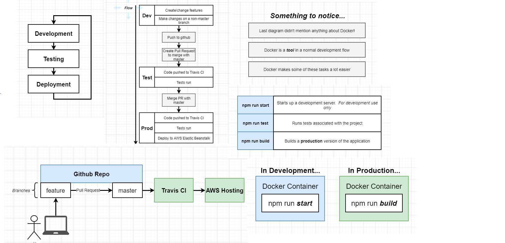
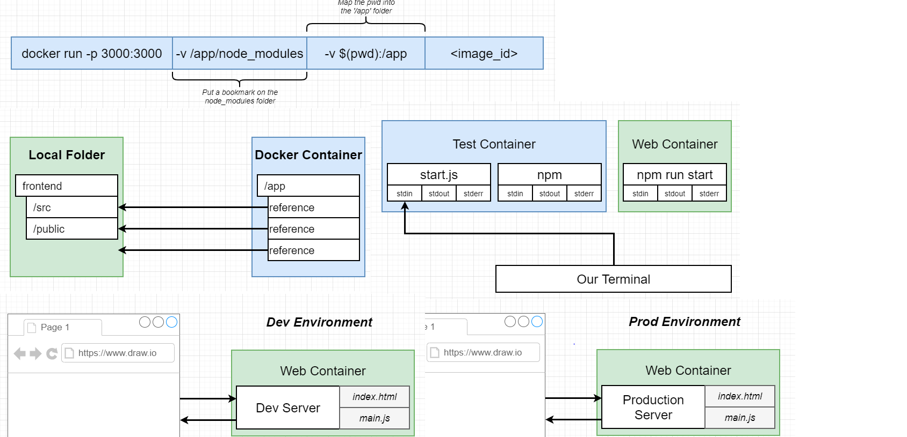
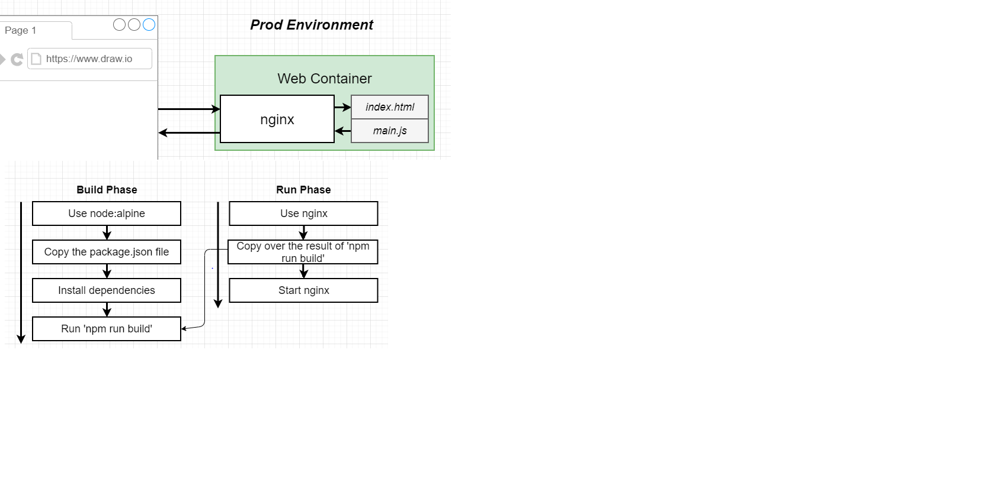

# Production Grade work-flows

```
npm install -g crate-react-app
create-react-app frontend
`npm run test`
`npm run build`
`npm run start`

- http://localhost:3000/
````
## Dev Docker file

Remove the npm_module duplicate dependencies manually as the container will anyways have this downloaded using
RUN npm install in Dockerfile.
docker run without -it is not working on windows

```
docker build -f Dockerfile.dev .
docker run -it -p 3000:3000 CONTAINER_ID
````
## Multistage build

```
FROM node:alpine as builder
WORKDIR '/app'
COPY package*.json ./
RUN npm install
COPY . .
RUN npm run build

FROM nginx
EXPOSE 80
COPY --from=builder /app/build /usr/share/nginx/html
````
## Docker compose

```
version: '3'
services:
  web:
    build:
      context: .
      dockerfile: Dockerfile.dev
    ports:
      - "3000:3000"
    volumes:
      - /app/node_modules
      - .:/app
  tests:
    build:
      context: .
      dockerfile: Dockerfile.dev
    volumes:
      - /app/node_modules
      - .:/app
    command: ["npm", "run", "test"]
````

## Executing Tests
```
docker build -it -f Dockerfile.dev .
docker run -it CONTAINER_ID npm run test
docker exec -it CONTAINER_ID npm run test
docker attach CONTAINER_ID
````
## Summary



