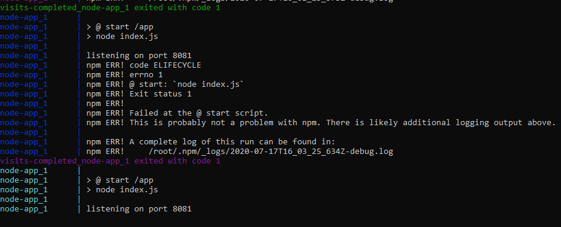
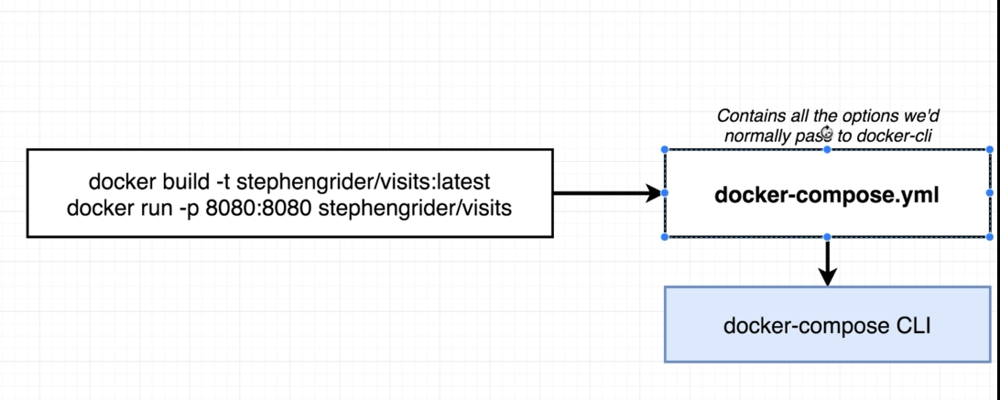
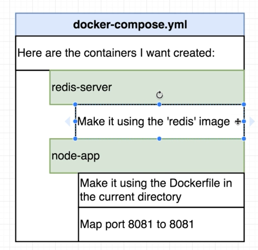
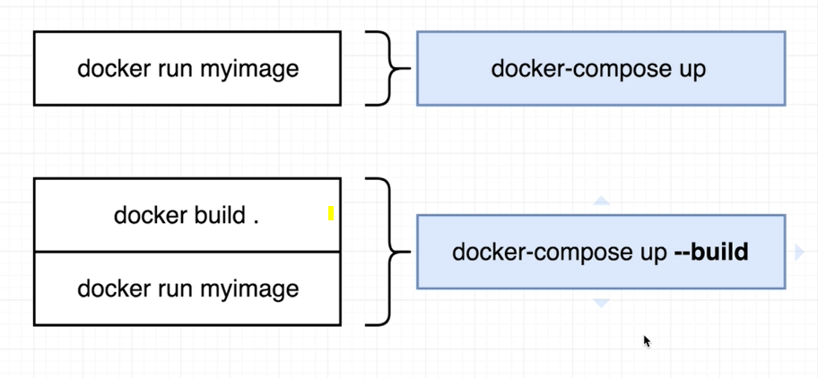
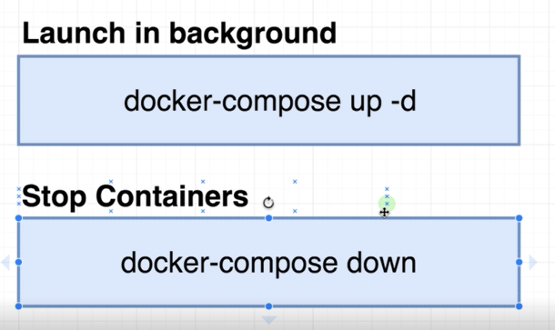
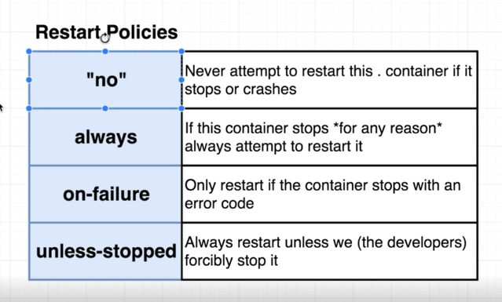

# Docker Compose with Multiple Local Containers
We are running 2 container in this demo
1) redis image from the docker hub
2) node app from the local docker file

node app will internally talk to redis container and get and increment the current value of visits key store and display.

```
docker-compose up
docker-compose down

docker-compose up --build -d
docker-compose down
docker-compose ps

```
### Running the Application
- http://localhost:4001/
```txt
Number of visits of Application - 1
```
## Docker compose
```
version: "3"
services:
  redis-server:
    image: "redis"
  node-app:
    restart: on-failure
    build: .
    ports:
      - "4001:8081"
````
## Docker file
```
FROM node:alpine

WORKDIR '/app'

COPY package.json .
RUN npm install
COPY . .

CMD ["npm","start"]
````
## Automatic Restarts
Container will keep restarting whenever there is failure
```txt
 process.exit(0) // Code
 restart: always // yml

 process.exit(1) // Code
 restart: on-failure // yml setting
 
```


## Summary








